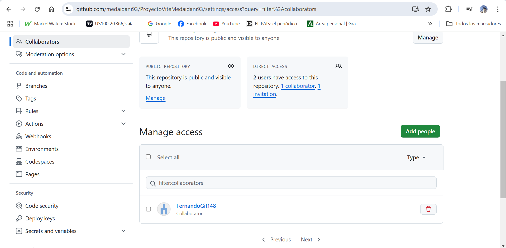
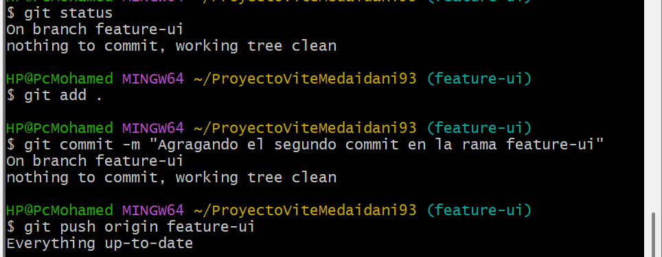
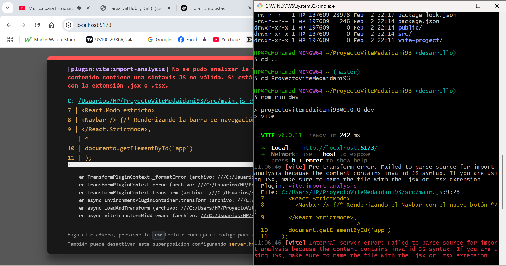
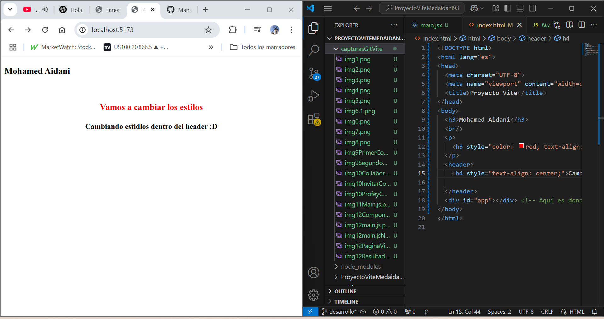

# ProyectoViteMedaidani93

## Resumen del Proyecto

Este proyecto fue creado para practicar los conceptos básicos de Git, GitHub y Vite. A continuación, se describen los pasos realizados en el desarrollo del proyecto, junto con imágenes representativas de cada paso.

---

## 1. Creación del Repositorio en GitHub

El primer paso fue crear un repositorio en GitHub llamado **ProyectoViteMedaidani93**.

---

## 2. Creación del Proyecto con Vite

Luego, se configuró el proyecto utilizando **Vite** para facilitar el desarrollo de la aplicación.

---

## 3. Adición de Archivos y Primer Commit

Se añadieron varios archivos, como `index.html`, `package.json`, y `style.css`, y se realizó el primer commit.

---

## 4. Trabajando con Ramas y Merge

Se crearon diferentes ramas para trabajar en características específicas. Finalmente, se realizó un **merge** de la rama `desarrollo` en `main`.

---

## 5. Resolución de Conflictos

Durante el merge, surgieron conflictos en el archivo `index.html`, los cuales fueron resueltos.

---

## 6. Subida al Repositorio de GitHub

Finalmente, todos los cambios se subieron a GitHub.

---

## Tecnologías Usadas

- **Git**: Control de versiones.
- **GitHub**: Repositorio remoto.
- **Vite**: Herramienta para configurar el entorno de desarrollo.
- **HTML/CSS/JavaScript**: Lenguajes utilizados en el proyecto.

---

## Contribuciones

Este proyecto es un esfuerzo personal para aprender y practicar las mejores prácticas con Git y GitHub. Si deseas colaborar, no dudes en hacer un fork del repositorio y abrir pull requests.

---

## Licencia

Este proyecto no tiene una licencia específica.

